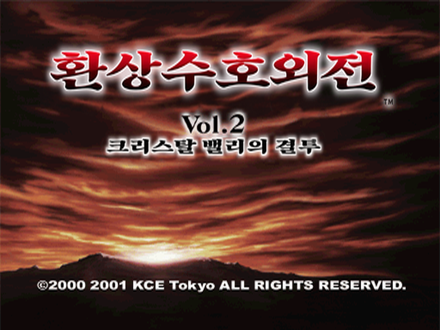

# 환상수호외전 Vol.2 크리스탈 밸리의 결투 한국어 패치



PlayStation 일본판 『幻想水滸外伝 Vol.2 クリスタルバレーの決闘』용 비공식 한국어 번역 패치입니다.
게임 이미지는 배포하지 않으며, 본인이 가진 원본 이미지에 적용하는 xdelta 차분 패치만 제공합니다.

> ⚠️ **패치는 반드시 아무것도 적용하지 않은 원본 이미지에 적용하세요.**

> **CG 100%까지 여러 회차를 플레이하며 검수했지만, 모든 선택지 갈래와 동작을 확인한 것은 아닙니다.**
> 오역, 어색한 문구, 멈춤이나 글자 깨짐이 남아 있을 수 있습니다.

1편 패치: [Suikogaiden_Vol.1_KR_Patch](https://github.com/melonoolong/Suikogaiden_Vol.1_KR_Patch)

## 지원 원본

| 항목 | 값 |
|---|---|
| 게임 | 幻想水滸外伝 Vol.2 クリスタルバレーの決闘 (일본판, SLPM-86663) |
| 파일 | `Gensou Suiko Gaiden Vol. 2 - Crystal Valley no Kettou (Japan).bin` (트랙 1개, MODE2/2352) + `.cue` |
| 크기 | 458,830,512 바이트 |
| CRC32 | `F11B6F29` |
| MD5 | `42649c8b52bb2aa28def0c51b36c6397` |
| SHA-1 | `da01346d921dd711c01593394bacd1c1697d62c4` |
| SHA-256 | `14fb9adf06802833c3fc7d392095bb6dad29e30c47088d5fd6d69d10dcd2d546` |

해시가 다르면 패치가 적용되지 않거나 결과가 달라집니다. 적용 전에 `.bin` 파일의 해시를 꼭 확인해 주세요.

## 패치 파일

| 파일 | 크기 | SHA-256 |
|---|---|---|
| `Suikogaiden_Vol2_KR_v0.5.0.xdelta` | 2,436,435 바이트 | `9efc704fa36ccb7f56392e2803bdc5cfb34de4c02c205f97cf8f05829497b52e` |
| `suikogaiden2_kr.cue` | 84 바이트 | 결과 `.bin`용 cue 파일 |

[Releases](../../releases)에서 받을 수 있습니다.

## 적용 방법

### xdelta UI / Delta Patcher (Windows)
1. `Suikogaiden_Vol2_KR_v0.5.0.xdelta`와 `suikogaiden2_kr.cue`를 받습니다.
2. xdelta UI 또는 Delta Patcher에서 **Patch**에 xdelta 파일, **Source**에 원본 `.bin` 파일을 지정합니다.
3. 결과 파일 이름을 `suikogaiden2_kr.bin`으로 정하고 적용합니다.
4. 받은 `suikogaiden2_kr.cue`를 결과 `.bin`과 같은 폴더에 두고, 에뮬레이터에서 이 `.cue`를 엽니다.

### xdelta3 명령줄
```
xdelta3 -d -s "Gensou Suiko Gaiden Vol. 2 - Crystal Valley no Kettou (Japan).bin" Suikogaiden_Vol2_KR_v0.5.0.xdelta suikogaiden2_kr.bin
```

결과 파일 이름을 다르게 정했다면, 원본 `.cue`를 복사해 `FILE "…"` 줄의 파일 이름만 바꿔 써도 됩니다.

### 적용 결과 확인

결과 이미지는 원본보다 약 5MB 큽니다. 로딩을 줄이려고 오프닝 영상을 디스크 끝으로 옮겼기 때문입니다.

| 항목 | 값 |
|---|---|
| 크기 | 464,164,848 바이트 |
| CRC32 | `21F9F011` |
| SHA-1 | `67ae1a001cb3f0c0c1bf758280860a2a4fc0f2d2` |
| SHA-256 | `92768ed6e060c30f6856afd58ca2b5b1d1c75a649f108d88d7c9c44560ed1d3f` |

## 현재 상태 (v0.5.0)

- 대사, 선택지, 메뉴, 메모리카드·세이브 연동 안내 문구를 한국어로 표시합니다.
- 타이틀 로고, 에피소드 제목 카드, 엔딩 영상의 로고를 한글로 바꿨습니다.
- 엔딩 스태프 롤과, 콘솔(에뮬레이터)의 메모리카드 관리 화면에 보이는 세이브 제목은 원문 그대로입니다.
- 한글 표시를 위해 게임 실행 파일(소프트 리셋 뒤 실행되는 `CHILD.EXE` 포함)과 글꼴 자료를 수정했습니다.
- 1편 패치에서 고친 검은 화면 멈춤 대책(한글 글꼴 고정 자리, 메모리 조각화 방지)을 처음부터 넣었습니다.
- 확인 환경: DuckStation 에뮬레이터. 실기(PS1)에서는 확인하지 않았습니다.

### 1편 데이터 연동

새 게임을 시작하면 외전 Vol.1 클리어 데이터를 불러올지 묻습니다. 1편 데이터에 든 이름(환상수호전Ⅰ·Ⅱ 주인공 등)과 CG 회수율에 따라 일부 장면과 대사가 달라집니다.

- **1편 한국어 패치의 클리어 데이터**를 연동하면 한글 이름이 그대로 이어집니다.
- **1편 데이터가 없으면** "아니요"를 고른 뒤 나오는 **추천 연동**을 쓸 수 있습니다. 기본 이름(주인공 리오우, 군·본거지 듀난, Ⅰ 주인공 티르)과 1편 클리어 상태를 넣고, CG 회수율을 둘 중에서 고릅니다.
  - **1%**: 첫 회차부터 R1 빨리 넘기기를 쓸 수 있습니다.
  - **100%**: 1편 회수율에 따라 열리는 장면까지 모두 볼 수 있습니다.
- 연동하지 않아도 끝까지 진행할 수 있습니다.

### 플레이 안내

- **빠르게 진행하려면**: 게임 메뉴(△) → 메시지 표시 → "즉시"로 바꾸고, 에뮬레이터의 CD-ROM 읽기 속도 향상(DuckStation: Read Speedup)을 쓰세요.
- 1편 데이터를 연동했고 그 회수율이 1% 이상이면 R1 버튼으로 대사를 빠르게 넘길 수 있습니다.

### 알려진 문제

- 실기(PS1)에서는 아직 확인하지 않았습니다.
- 추천 연동 화면과 연동 이름 표시는 기계어 해석기로 모든 갈래를 확인했지만, 실제 화면 확인은 일부만 했습니다.

문제를 발견하면 Issues에 장면, 스크린샷, 사용한 에뮬레이터(또는 실기)를 함께 알려 주세요. 멈춤이면 멈추기 직전에 한 조작도 같이 적어 주시면 빨리 찾을 수 있습니다.

## 변경 이력

### v0.5.0 (2026-10-09)
- 첫 공개 릴리스.

## 글꼴

이 패치는 글꼴 파일을 담지 않고, 아래 글꼴로 미리 그린 글자 그림만 게임 자료에 넣었습니다.

| 쓰인 곳 | 글꼴 | 라이선스 |
|---|---|---|
| 대사·메뉴 본문 글자, 반각 영숫자, CG 수집률 표시 | Galmuri14, Galmuri11 | [SIL OFL 1.1](licenses/OFL-Galmuri.txt) |
| 에피소드 제목 카드 | Noto Serif KR | [SIL OFL 1.1](licenses/OFL-NotoSerifKR.txt) |

타이틀과 엔딩 영상의 로고·부제 글씨는 글꼴이 아니라 따로 만든 글씨 그림입니다.

## 면책

- 이 프로젝트는 팬 번역이며 Konami와 관련이 없습니다.
- 幻想水滸伝(Suikoden)과 관련 상표·저작물의 권리는 각 권리자에게 있습니다.
- 게임 이미지, BIOS, 원본 데이터는 제공하지 않습니다. 본인이 소유한 원본으로만 사용해 주세요.
- 패치 사용으로 생긴 문제에 대해 책임지지 않습니다.
